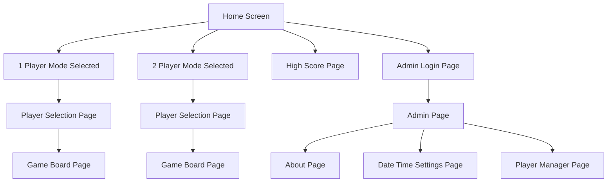
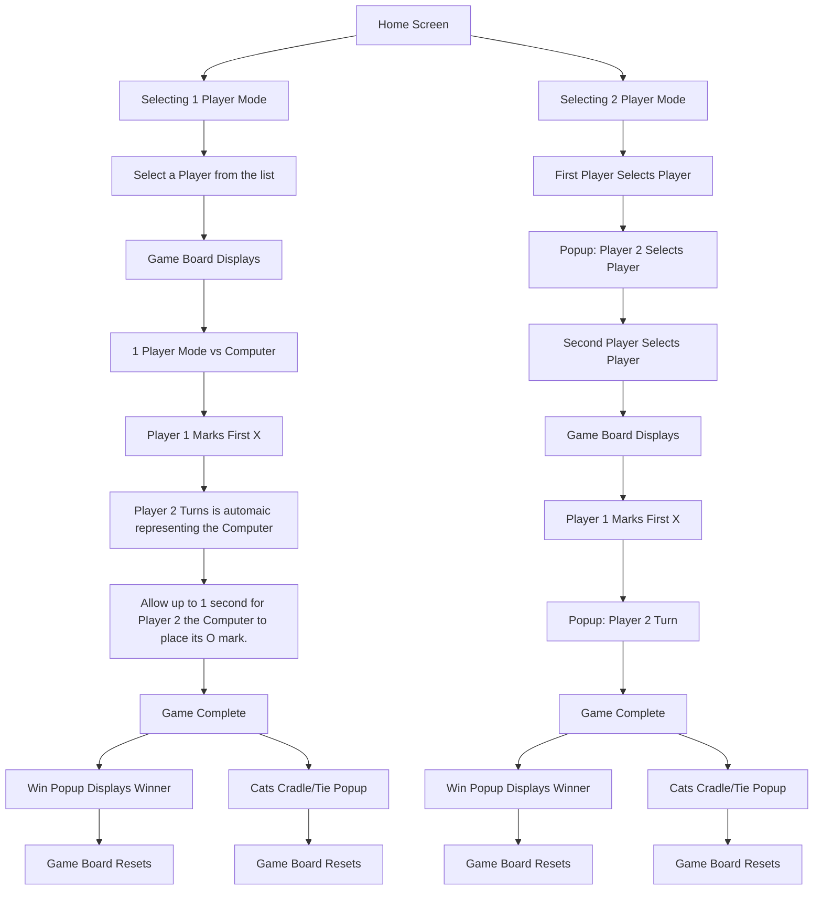

# Tic-Tac-Toe

## About
- A simple Tic Tac Toe game developed using Qt, C++/QML, CMake, and SQLite3.

## Objective
- Create a Qt C++/QML application for a RPI4 touch screen device and all of its supporting infastructure. 

## Project Structure

```plaintext
tic-tac-toe 
├── Setup Directory 
│   └── package and dependencies script 
├── TicTacToe Game Directory 
│   ├── Database (SQLite3 db) 
│   ├── Documents (project docs)
│   ├── Config (application qsettings file)
│   ├── Images (graphics used by game) 
│   ├── Controllers (C++ M-V-C) 
│   ├── QML (view) 
│   ├── Models (used by view) 
│   ├── JavaScript (functions used by view) 
│   └── CMakeLists.txt 
├── README.md 
├── .gitignore 
└── .git
```

## Building and Running
- **Currently compiled and tested on Ubuntu 22.04**

### Packages and Dependencies
- At the root of the project, in the `setup` directory, there is a shell script used to set up the necessary packages for development on Ubuntu 22.04.
- Locate and run `install.sh`:
  - This script will also set up your `/data` directory for database and configuration files.

### Creating a New Database
- Run the Python script to create a new database and place it in the `/data/database` directory or run the copy shell script `copy_db.sh`.

### Running the Project
- Open the TicTacToe project in Qt Creator, set up the compiler, and build and run the project.

## Screen/Page Layout


## Game Mode


- **Screen Navigation Buttons** (located in the footer of the application)
  - Home button
  - Back button

## Admin Mode
- You can log in as an admin user from the home screen by clicking the login admin button.
  - Username: `admin`
  - Password: `admin`
- Admin mode gives you access to system setting features:
  - About Page: displays system information. 
  - Date Time Settings Page (Partially complete)
  - Player Manager Page (Partially complete)

### Player Management 
- By default the application is loaded with 10 defualt players.
- The max players allowed is 10.
- Using the Player Manager Utility Admins can edit/configure existing and new players

## Features Incomplete
Below is a list of features not yet complete:
- **QSetting Files** (Partial)
  - Date/Time Setting (Admin Only)
- **Player Management** (Admin Only)
- **High Score** (Partial)
  - TODO: Verify Accumulation of player scores and save to the database.
- **IoT High Score Web App**
  - Implement the AWS web application for displaying high scores.
- **Mqtt API Creation and Integration**
  - Create API and coresponding API Document.
  - Mqtt Connectivity and payload managemnet.
- **Custom Log Agent**
  - Create a custom message handler  
    
## TODO
- **TODO List**
  - Inprogress: Player Management for Admin User.
  - Inprogress: date/time settings for Admin User.
  - Inprogress: integrating QSettings File. 
  - Improve: threading with QMutex locking.
  - Improve: class design by implementing common base class.
  - Improve: Object Oriented design by implementing smart pointers.
  - Implement: Export high score list feature.
  - Clean up: Debug / Warning / Fatal statements
    - create debug/engineering mode to capture more verbose data
  - Implement: create AWS web application to display high score table over the web.
  - Integrate: MQTT protocol and payload management.
  - Create: custom Poky build for RootFS.
  - **Custom Poky Build** (Partial)
    - Inprogress: Create Poky recipes.
      - Housed in a separate repo.
      - Consisting of Qt6, supporting packages, patches, touch screen driver, application and database.
      - Build directory structure to include /data and /application directories. 
  - Inprogress: cross-compiled RPI binary to Poky recipes.
  - Integrate: touch screen driver to Poky recipes.
  - Integrate: SSH capabilities for remote connections.
  - Deploy: Write OS and application to RPI SD Card.
  - **Create boot up script.**
    - /etc/init.d/
    - ln -s /etc/init.d/TicTacToe /etc/rc3.d/S99TicTacToe
    - update-rc.d TicTacToe defaults
  - **Other Game Modes**:
    - Implement: sub project Connect 4.
    - Implement: sub project Battleships.


## Icon Images Source 
- **Google Fonts**
  - https://fonts.google.com/icons?icon.size=24&icon.color=%235f6368
 
```plaintext
tic-tac-toe 
├── TicTacToe Game Directory 
│   ├── Images (google font: graphics used by game)
```


